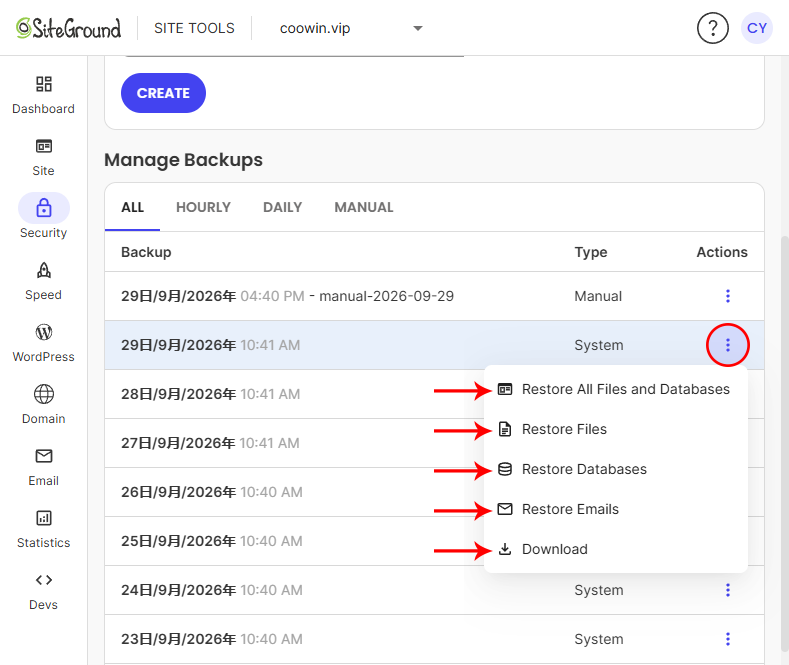

# SiteGround 网站完整备份指南

本文记录一套已经实际验证过的 SiteGround 网站备份流程，适用于 WordPress、PHP + MySQL 与 PHP + SQLite 项目。

本指南同时覆盖两套恢复思路：

```text
SiteGround 平台自动备份 / 手动恢复点
+
SSH + 本地独立备份
```

两者不是互相替代，而是组成一套更可靠的备份与灾难恢复体系。

---

## 一、备份分层

建议把备份分成三层：

| 层级 | 方式 | 主要用途 |
|---|---|---|
| 第一层 | SiteGround 自动备份 | 日常故障快速恢复 |
| 第二层 | SiteGround 手动备份 | 重大修改前建立明确恢复点 |
| 第三层 | SSH + 本地独立备份 | 异地灾备、迁移、长期归档 |

核心区别：

```text
自动备份 = 平台日常恢复
手动备份 = 关键节点快照
本地备份 = 真正由自己持有的数据
```

SiteGround 内置备份主要用于平台内快速恢复；本地独立备份则不依赖同一家主机服务商，更适合迁移、长期归档和灾难恢复。

---

## 二、SiteGround 自动备份与后台恢复机制

进入：

```text
Site Tools
→ Security
→ Backups
```

可以看到系统自动生成的每日备份，以及当前套餐允许使用的手动备份、小时备份或下载功能。

下面是实际 SiteGround 后台中的恢复菜单：



### 2.1 截图中的五个选项分别是什么

| 选项 | 恢复对象 | 典型场景 |
|---|---|---|
| `Restore All Files and Databases` | 网站文件 + 数据库 | 网站整体出现严重问题，需要恢复到某个历史状态 |
| `Restore Files` | 网站文件 | 主题、插件、PHP、上传文件、SQLite 文件等出现问题 |
| `Restore Databases` | 数据库 | WordPress 内容、设置、用户、插件数据等数据库内容出现问题 |
| `Restore Emails` | 邮箱 | 邮件误删或邮箱数据需要回滚 |
| `Download` | 下载该恢复点的完整备份 | 本地归档、迁移、异地灾备 |

> `Download` 是否可用取决于 SiteGround 当前套餐或相关备份服务。当前截图中该功能已经显示为可用。

### 2.2 WordPress 为什么可以把“文件”和“数据库”分开恢复

一个典型 WordPress 网站可以拆成两层：

```text
WordPress 网站
│
├── 文件系统
│   ├── WordPress 核心文件
│   ├── wp-content/
│   │   ├── themes/
│   │   ├── plugins/
│   │   └── uploads/
│   ├── wp-config.php
│   └── .htaccess
│
└── 数据库
    ├── wp_posts
    ├── wp_postmeta
    ├── wp_options
    ├── wp_users
    ├── wp_terms
    └── 插件自定义数据表
```

因此：

```text
Restore Files
```

解决的是文件层问题，而：

```text
Restore Databases
```

解决的是数据库层问题。

### 2.3 Restore Files 的底层逻辑

假设某一天修改了：

```text
wp-content/themes/example/functions.php
```

导致网站报错。

如果数据库本身没有问题，优先考虑：

```text
Restore Files
```

概念上可以理解为：

```text
历史备份中的文件
        ↓
选择需要恢复的文件 / 目录
        ↓
恢复到当前网站文件系统
```

这比直接恢复整站更安全。

### 2.4 Restore Databases 的底层逻辑

数据库恢复可以理解为：

```text
历史数据库备份
      ↓
选择目标数据库
      ↓
恢复数据库内容
```

逻辑上类似于我们手动执行：

```text
mysqldump  →  生成数据库备份
mysql      →  导入数据库备份
```

但 SiteGround 内部使用的是自己的备份基础设施，并不等于后台真的只是执行这两条命令。

### 2.5 Restore All Files and Databases

这个选项影响范围最大。

可以近似理解为：

```text
某个历史恢复点
      │
      ├── Files
      │     ↓
      │  当前网站文件
      │
      └── Databases
            ↓
         当前数据库
```

适合：

- 网站文件和数据库同时出现严重问题；
- 中毒或批量损坏；
- 重大升级失败；
- 无法准确判断是文件还是数据库问题。

但不要把它当成默认恢复按钮。

### 2.6 Restore Emails

邮箱数据和 WordPress 数据库不是一套系统。

可以理解为：

```text
网站
├── Files
├── MySQL / PostgreSQL
└── Mailboxes
```

因此 SiteGround 单独提供：

```text
Restore Emails
```

用于恢复邮箱账号中的邮件数据。

### 2.7 Download

下载功能用于把 SiteGround 平台中的恢复点保存到自己的电脑，用于本地归档、迁移或异地灾备。

它的价值在于：

```text
SiteGround 在线备份
        ↓
下载
        ↓
自己的本地备份
```

从而减少“所有备份都依赖同一个服务商”的风险。

### 2.8 自动备份的底层原理应该如何理解

不要简单理解成：

```text
每天把 public_html 压缩成一个 ZIP
```

更准确的理解是：

```text
生产网站
│
├── Files
├── Databases
├── Emails
└── 其他受支持的数据
        ↓
SiteGround Backup Infrastructure
        ↓
不同时间点的 Restore Points
```

恢复时，再从指定时间点提取不同的数据组件。

### 2.9 “恢复”不一定等于严格意义上的磁盘快照回滚

不要把后台恢复机械理解为：

```text
把整个磁盘强制恢复成昨天一模一样
```

更准确的理解应该是：

```text
把备份中的目标数据恢复回来
≠
保证所有后来新增的数据都被自动清除
```

所以如果网站遭遇恶意文件注入，恢复之后仍然应该再次检查文件系统，而不是仅仅看到首页恢复正常就结束。

### 2.10 最小恢复原则

以后遇到网站故障，不建议形成：

```text
网站坏了
→ Restore All
```

而应该形成：

```text
网站异常
   ↓
判断故障层
   ↓
文件？
数据库？
邮箱？
文件 + 数据库？
   ↓
选择最小恢复范围
   ↓
恢复
   ↓
完整验收
```

常见判断：

| 问题 | 优先考虑 |
|---|---|
| `functions.php` 改坏 | Restore Files |
| WordPress 主题损坏 | Restore Files |
| 插件文件损坏 | Restore Files |
| uploads 图片文件损坏 | Restore Files |
| WordPress 文章误删 | Restore Databases |
| WP 后台设置误改 | Restore Databases |
| WordPress 用户数据问题 | Restore Databases |
| 插件数据库表损坏 | Restore Databases |
| 整站文件和数据库同时损坏 | Restore All Files and Databases |
| 邮件误删 | Restore Emails |

核心原则：

> **能局部恢复，就不要优先整体恢复。**

### 2.11 为什么整体恢复可能造成“新数据回退”

例如：

```text
昨天 12:58    SiteGround 自动备份

今天 08:00    发布一篇文章
今天 09:00    收到 5 条询盘
今天 10:00    修改 functions.php
今天 10:05    网站报错
```

如果执行：

```text
Restore All Files and Databases
```

那么：

```text
functions.php      ✅ 可以恢复
今天新增文章        ⚠️ 可能被数据库回退
今天新增询盘        ⚠️ 可能被数据库回退
今天修改的设置      ⚠️ 可能被数据库回退
```

如果问题只发生在文件层，则：

```text
Restore Files
```

通常更加合适。

### 2.12 Elementor 页面属于哪一层

Elementor 的页面结构和大部分页面内容主要保存在 WordPress 数据库中。

因此：

```text
PHP 模板坏了           → Files
Elementor 页面内容误改 → Databases
```

实际问题中仍要根据具体修改对象判断。

### 2.13 WordPress 图片为什么同时涉及文件和数据库

上传一张图片时：

```text
/wp-content/uploads/.../product.jpg
```

是真实文件。

与此同时，WordPress 会在数据库中保存附件记录。

因此图片相关数据实际上是：

```text
文件系统
└── product.jpg

数据库
└── attachment ID / URL / 标题 / 元数据
```

这解释了为什么只恢复其中一层，有时会出现：

```text
数据库有记录，但文件不存在
```

或：

```text
文件存在，但媒体库没有正确记录
```

### 2.14 SQLite 项目特别注意

SQLite 和 MySQL 最大区别之一是：

```text
MySQL
= 独立数据库服务

SQLite
= 一个数据库文件
```

例如：

```text
public_html/database/app.sqlite
```

对于 SiteGround 文件备份系统而言，它首先是一个文件。

因此：

```text
Restore Files
```

通常也会涉及 SQLite 数据库文件。

而：

```text
Restore Databases
```

主要针对 SiteGround 数据库服务中的数据库，不应把 SQLite 理解成这里的 MySQL / PostgreSQL 数据库恢复。

对于重要 SQLite 项目，仍建议额外保留应用级导出或 SQLite 独立备份，避免完全依赖主机文件备份。

### 2.15 一个容易记住的模型：游戏存档

可以把 SiteGround 自动备份理解成：

```text
Save 1 → 30 日
Save 2 → 29 日
Save 3 → 28 日
...
```

但恢复时可以进一步选择：

```text
文件        → Restore Files
数据库      → Restore Databases
邮箱        → Restore Emails
文件+数据库 → Restore All Files and Databases
```

这个模型便于记忆，但真正执行恢复时仍然要遵守“最小恢复原则”。

---

## 三、完整备份包含什么

### WordPress / PHP + MySQL

完整备份通常包括：

```text
网站文件
+
MySQL 数据库
```

推荐最终保存：

```text
<site>-files-YYYY-MM-DD.tar.gz
<site>-database-YYYY-MM-DD.sql.gz
```

### PHP + SQLite

SQLite 数据库本身就是文件。如果 SQLite 文件位于 `public_html` 内，那么整站打包时通常已经一起包含数据库。

---

## 四、推荐本地目录

```text
D:\Website-Backups\
└── example.com\
    └── YYYY-MM-DD\
        ├── example-com-files-YYYY-MM-DD.tar.gz
        └── example-com-database-YYYY-MM-DD.sql.gz
```

---

## 五、先确认命令环境

看到：

```text
PS C:\Users\Administrator>
```

说明当前在 Windows PowerShell。

看到类似：

```text
user@server:~$
```

说明当前在 SiteGround Linux Shell。

记忆原则：

> 服务器负责生成备份，Windows 负责把备份下载回来。

---

## 六、定位网站目录

登录 SSH 后：

```bash
pwd
ls -la
cd ~/www
ls -la
```

网站通常位于：

```text
~/www/<domain>/public_html
```

WordPress 典型结构：

```text
wp-admin
wp-content
wp-includes
wp-config.php
```

自定义 PHP 项目可能看到：

```text
admin
content
includes
config.php
index.php
```

---

## 七、查看网站大小

```bash
cd ~/www/<domain>/public_html
du -sh .
du -sh * 2>/dev/null
```

用于判断网站总大小以及主要空间占用。

---

## 八、打包网站文件

先进入站点目录上一级：

```bash
cd ~/www/<domain>
```

打包：

```bash
tar -czf ~/tmp/<site>-files-YYYY-MM-DD.tar.gz public_html
```

检查文件：

```bash
ls -lh ~/tmp/<site>-files-YYYY-MM-DD.tar.gz
```

不要把完整备份放在 `public_html`，避免通过 Web URL 暴露备份文件。

---

## 九、MySQL 数据库备份

WordPress 通常从 `wp-config.php` 查数据库信息；自定义 PHP 项目通常从 `config.php` 查。

需要确认：

```text
DB_HOST
DB_NAME
DB_USER
DB_PASSWORD
```

不要把真实数据库密码提交到 GitHub。

导出示例：

```bash
mysqldump -h localhost -u <DB_USER> -p --single-transaction --quick <DB_NAME> > ~/tmp/<site>-database-YYYY-MM-DD.sql
```

执行后再输入数据库密码，避免把密码直接写进命令历史。

检查：

```bash
head -n 20 ~/tmp/<site>-database-YYYY-MM-DD.sql
tail -n 20 ~/tmp/<site>-database-YYYY-MM-DD.sql
```

统计表数量：

```bash
grep -c "Table structure for table" ~/tmp/<site>-database-YYYY-MM-DD.sql
```

压缩：

```bash
gzip ~/tmp/<site>-database-YYYY-MM-DD.sql
gzip -t ~/tmp/<site>-database-YYYY-MM-DD.sql.gz
```

---

## 十、下载到 Windows

回到 Windows PowerShell 后，先创建目录：

```powershell
New-Item -ItemType Directory -Force "D:\Website-Backups\<domain>\YYYY-MM-DD"
```

源码：

```powershell
scp -i "$env:USERPROFILE\.ssh\siteground" -P <SSH_PORT> <SSH_USER>@<SSH_HOST>:/home/<SSH_USER>/tmp/<site>-files-YYYY-MM-DD.tar.gz "D:\Website-Backups\<domain>\YYYY-MM-DD\"
```

数据库：

```powershell
scp -i "$env:USERPROFILE\.ssh\siteground" -P <SSH_PORT> <SSH_USER>@<SSH_HOST>:/home/<SSH_USER>/tmp/<site>-database-YYYY-MM-DD.sql.gz "D:\Website-Backups\<domain>\YYYY-MM-DD\"
```

注意：SSH 指定端口通常使用小写 `-p`，SCP 使用大写 `-P`。

---

## 十一、本地验证

查看源码压缩包：

```powershell
tar -tzf "D:\Website-Backups\<domain>\YYYY-MM-DD\<site>-files-YYYY-MM-DD.tar.gz" | Select-Object -First 20
```

如果能正常列出 `public_html` 内文件，说明压缩包可读取。

---

## 十二、SHA256 完整性校验

服务器端：

```bash
sha256sum ~/tmp/<site>-files-YYYY-MM-DD.tar.gz
sha256sum ~/tmp/<site>-database-YYYY-MM-DD.sql.gz
```

Windows：

```powershell
Get-FileHash "D:\Website-Backups\<domain>\YYYY-MM-DD\<site>-files-YYYY-MM-DD.tar.gz" -Algorithm SHA256
Get-FileHash "D:\Website-Backups\<domain>\YYYY-MM-DD\<site>-database-YYYY-MM-DD.sql.gz" -Algorithm SHA256
```

两端 SHA256 一致，说明传输后的文件与服务器原文件一致。

---

## 十三、正确的操作顺序

```text
1. 打包网站文件
2. 导出数据库
3. 服务器端验证
4. 服务器端计算 SHA256
5. SCP 下载
6. Windows 本地验证
7. Windows 计算 SHA256
8. 对比一致
9. 最后清理服务器端自己生成的临时备份
```

不要提前删除服务器临时文件，否则无法继续做服务器端完整性对比。

---

## 十四、MySQL 与 SQLite 的区别

MySQL 数据通常独立于网站目录，因此完整备份通常是：

```text
源码 tar.gz + 数据库 sql.gz
```

SQLite 是文件数据库。如果数据库文件位于 `public_html` 内，整站打包通常已经包含它。

---

## 十五、常见错误

### `Permission denied (publickey)`

通常表示 SSH 私钥认证失败。检查 SiteGround 是否创建或导入了 SSH Key、本地 Private Key 是否正确，以及 SSH 是否指定了正确私钥。

### 在 Linux Shell 中执行 PowerShell 命令

`$env:USERPROFILE` 属于 PowerShell 变量，不能在 Linux Bash 中使用。需要先退出 SSH 回到 `PS C:\...>` 再执行 SCP。

### 在 PowerShell 中执行 Linux 路径

PowerShell 中的 `rm` 是 `Remove-Item` 别名，并不会删除 SiteGround 上的文件。删除服务器临时文件前必须先 SSH 登录服务器。

---

## 十六、安全原则

公开仓库中不要出现真实的：

- SSH Private Key；
- Passphrase；
- 数据库密码；
- WordPress 管理员密码；
- API Key；
- SMTP 密码。

文档统一使用：

```text
<SSH_HOST>
<SSH_USER>
<SSH_PORT>
<DB_NAME>
<DB_USER>
<domain>
<site>
YYYY-MM-DD
```

---

## 十七、推荐长期工作流

```text
日常
→ SiteGround 自动备份

重大修改前
→ SiteGround 手动备份

定期 / 重要节点
→ SSH 完整独立备份到本地

发生故障
→ 先判断文件 / 数据库 / 邮箱
→ 使用最小恢复范围
→ 完整验收
```

以后可以进一步自动化为 PowerShell 脚本，但建议先把手工流程完全跑通、验证后再自动化。

---

## 十八、官方参考

- SiteGround：How to use the Backup service in Site Tools?
  - https://www.siteground.com/kb/backup-service/
- SiteGround：How to restore my public_html directory?
  - https://www.siteground.com/kb/how_to_restore_my_public_html_directory/

> 官方功能、套餐和界面以后可能调整。实际操作时以当前 Site Tools 界面和 SiteGround 官方说明为准。

---

## 总结

对于 WordPress / PHP + MySQL：

```text
完整备份 = 网站文件 + MySQL 数据库
```

对于 PHP + SQLite：

```text
完整备份 = 网站文件（其中可以包含 SQLite 数据库文件）
```

对于 SiteGround 后台恢复：

```text
先判断故障层
→ 选择最小恢复范围
→ 恢复
→ 验收
```

最终原则：

> **备份的价值不在于“文件已经生成”，而在于“能够验证、能够下载、能够找到、必要时能够恢复”。**

以及：

> **恢复的核心不是“恢复得越多越保险”，而是“准确判断故障层，只恢复真正需要恢复的数据”。**
